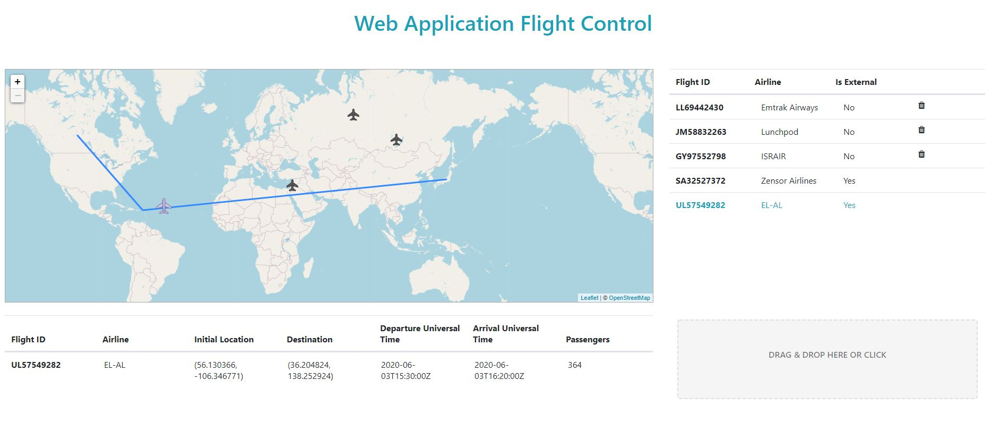
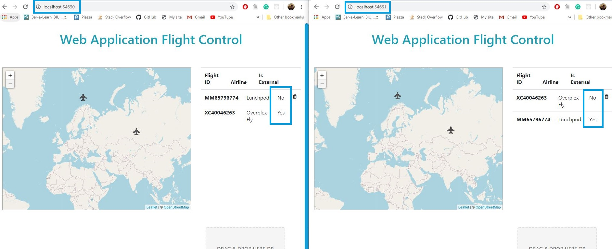

# FlightControl
Advanced programming 2 course, flight control web application

Created by: Almog Lev, Eyal Golan, Sapir Deutscher and Ofir Netzer.

## Preview

A flight control RESTful web application.

We built our frontend using Javascript, JQuery, bootstrap, html and css. 

The backend was built using C#, ASP.NET Core, and Entity Framework (with in-memory SQL DB). We created a RESTful API using WebAPI.
For unit testing we used Moq.

The web application features a flight control system that shows active flights, enables adding new flight plans and shows details about each flight. Upon clicking on a flight, its path is shown on the map.



## Program explanation

### API

The api supports the following actions:

Action | Path | Description
------ | --------- | ----------
GET | /api/Flights?relative_to=<DATE_TIME> | Returns all the internal flights active in DATE_TIME
GET | /api/Flights?relative_to=<DATE_TIME>&sync_all | Returns all flights (internal and external) active in DATE_TIME
POST | /api/FlightPlan | Adds a new flight plan
GET | /api/FlightPlan/{id} | Returns the flight plan with the given id
DELETE | /api/Flights/{id} | Deletes the flight with the given id
GET | /api/servers | Returns all the external servers that provide flight data to the application
POST | /api/servers | Adds a new external server
DELETE | /api/servers/{id} | Deletes the server with the given Id from the external servers list

### Adding Flights

The user can add a flight by dragging a flight plan json file into the drag and drop area.

The structure of a flight plan json is as follows:

```
{
  "passengers": 257,
  "company_name": "ISRAIR",
  "initial_location": {
    "longitude": 21.239979,
    "latitude": 32.026706,
    "date_time": "2020-06-03T13:30:00Z"
  },
  "segments": [
    {
      "longitude": 23.240702,
      "latitude": 34.921971,
      "timespan_seconds": 1000
    },
    {
      "longitude": 21.346370,
      "latitude": 39.419221,
      "timespan_seconds": 2000
    }
  ]
}
```

### Interacting with external servers

The application can also connect with external servers and show their flights:

The following image shows two seperate sites. Each site has its own internal server. The site on the left has the internal server of the site on the right as its external server. Simillary, the right site has the internal server of the left site as its external server. 



### DB structure

We use an in-memory SQL DB that contains several tables. We use seperate tables for internal and external flights to make our queries more efficient.

The database structure is as follows:


